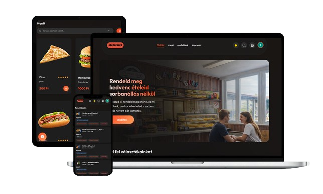

<div align="center">
  
  
  <h1>🍔 GépészBüfé</h1>
  <p><b>Modern, MERN-stack alapú iskolai büfé előrendelő rendszer (Vizsgaremek projekt)</b></p>
  
  [](#)
  [](#)
  [](#)
  [](#)
</div>

<br />

## 📖 A projektről

A **GépészBüfé** egy webes alapon működő ételrendelő platform, amely kifejezetten az iskolai logisztika és az intézményi étkeztetés gyorsítására épült. A rendszer fő célja, hogy megoldja a korlátozott idejű iskolai szünetekben kialakuló sorban állás és készpénzes tranzakciók okozta torlódásokat. 

A projekt három fő pilléren nyugszik:
1. Egy gyors és letisztult **Vásárlói Felület** a diákok és tanárok számára.
2. Egy valós időben frissülő **Adminisztrációs Panel** a büfé személyzetének.
3. Egy biztonságos és skálázható **Backend API**, kiegészülve egy felhőalapú adatbázissal.

A szoftver szoftverfejlesztő és tesztelő **vizsgaremekként** készült, ötvözve a legújabb webes technológiákat, a reszponzív modern dizájnt és az iparági szintű architektúra elveket.

---

## ✨ Főbb funkciók

### 👨‍🎓 Vásárlóknak (Frontend)
- **Felhasználói Fiókok:** Gyors regisztráció és biztonságos bejelentkezés (JWT token autentikáció).
- **Interaktív Étlap:** Szűrhető és kereshető termékkínálat, valós idejű kosárkezeléssel.
- **Rendelés Követés:** Feladott rendelések állapotának nyomon követése a fiókból, illetve átvételi kód (azonosító) generálása.
- **Reszponzív UX/UI:** Mind okostelefonon, mind asztali környezeten "Glassmorphism" elemekkel gazdagított, gördülékeny dizájn. Éjszakai / Sötét mód (Dark mode) támogatás.

### 👩‍🍳 Büféseknek (Admin Panel)
- **Átlátható Rendeléskezelés:** Beérkező rendelések listázása, megrendelői azonosító szerinti azonnali keresés és valós idejű állapotfrissítés ("Készítés alatt" -> "Kihozva").
- **Készlet- és Kínálat Menedzsment:** Új termékek hozzáadása fotóval ellátva, árak és kategóriák módosítása – mindez kódolás nélkül, felhasználóbarát felületen.
- **Modern Vezérlőpult:** Mobil és asztali adatszűrés, felesleges oldaltöltések nélkül.

---

## 🛠️ Alkalmazott Technológiák (Tech Stack)

A projekt a népszerű **MERN** (*MongoDB, Express.js, React, Node.js*) architektúrára épül.

*   **Kliens oldal (Frontend & Admin):** React.js, React Router DOM, Context API, Vanilla CSS.
*   **Szerver oldal (Backend):** Node.js, Express.js.
*   **Adatbázis:** MongoDB (Mongoose ORM segítségével).
*   **Biztonság:** JSON Web Token (JWT) alapú hitelesítés, Bcrypt (jelszókódolás), CORS.
*   **Média és Fájlkezelés:** Multer.

---

## 🚀 Fejlesztői Környezet Beállítása (Telepítés)

Ha lokálisan (a saját gépeden) szeretnéd futtatni az alkalmazást, kövesd az alábbi lépéseket:

### Előfeltételek:
- **Node.js** (LTS verzió) telepítve a gépeden.
- **MongoDB** fiók (Atlas felhő) vagy lokális MongoDB Compass futtatása.

### 1. A projekt letöltése
```bash
git clone https://github.com/Froxy555/Viszgaremek26_IAT_gepeszbufe.git
cd food-del
```

### 2. A Függőségek (Dependencies) telepítése
Mivel a projekt három különálló mappából tevődik össze, mindegyikbe telepíteni kell a szükséges NPM csomagokat:
```bash
# Backend telepítése
cd backend
npm install

# Frontend telepítése
cd ../frontend
npm install

# Admin telepítése
cd ../admin
npm install
```

### 3. Környezeti változók (.env) beállítása
Hozzá kell hozni egy `.env` fájlt a `backend` mappában a következő kulcsokkal (Példa):
```env
PORT=4000
MONGO_URI=mongodb+srv://<felhasznalonev>:<jelszo>@<cluster>.mongodb.net/gepeszbufe
JWT_SECRET=super_secret_key_ide_kerul
```

### 4. Rendszer elindítása (Fejlesztői mód)
Indítsd el a három komponenst három különálló terminál ablakban:

**Terminal 1 (Backend API):**
```bash
cd backend
npm run server
```
**Terminal 2 (Vásárlói Frontend):**
```bash
cd frontend
npm run dev
```
**Terminal 3 (Admin Panel):**
```bash
cd admin
npm run dev
```

Miután mindegyik sikeresen elindult, a böngészőből elérhető az alkalmazás a terminálok által megadott címein (jellemzően `http://localhost:5173` és `5174`).

